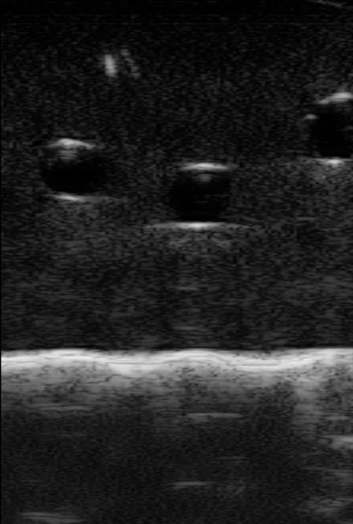

# Locating Veins on Infrared(Gray) Images for IV Insertion with Two Approaches - Segementation(U-Net) | Detection(YOLO)

This project is an self-implemented submodule of Robotic IV Insertion Project affiliated with a Duke Medical Lab, which has the similar idea as a paper Visual Vein-Finding for Robotics IV Insertion by R. D. Brewer and J. K. Salisbury. Genereally speaking, a fast and automated algorithm to find the precise vein edges on the captured infrared images can help suggest insertion points(region) for a human or robotic practitioner.

The images look like the following one because the deoxygenated haemoglobin in veins absorb infrared light more than surrounding tissues, which makes the veins appear as dark on a lighter background.

<p align="center">  </p>


# Progress & Notes
[Mid-term Report](https://docs.google.com/presentation/d/1ixdv6zaCGtkkfqN84M2ob_LZV4D6BFkfnUIeEUIfd7A/edit?usp=sharing)

修改意见：
- 介绍segmentation的网络结构时，放一个sample input和sample output
- segmentation results visualization可以用如下形式：
  ```
              human_label  
            /              \
  input_img                   overlapped image (two color layers showing direct differernce)
            \              / 
              predicte_img
  ```

## Segmentation - UNet
### Jan 30
- add 20 pairs of img-mask into 'data' directory
- modify the original n_channels = 3 to n_channels = 1 in train.py and predict.py when instantiating an U-Net
- modify glob() in __getitem__ of BasicDataset so that one img to one mask
- pip3 install future, tb-nightly (for torch.utils.tensorboard.SummaryWriter) - 'past module not installed'
- batchsize目前看来只能是1，待研究其中的原因。
- 解决了不能打开tensorboard的问题：运行diagnose_tensorboard.py文件，根据suggestions进行操作。- 实际上就是因为前面装了tb-nightly和pytorch内置的tensorboard冲突了。
- 解决了working with remote jupyter notebook ipynb on local vscode:（推荐方法二）
    - 方法一：
        - 在remote server terminal上运行 jupyter notebook --no-browser --port=8889
        - 在本地terminal运行 ssh -N -f -L localhost:8888:localhost:8889 joey@0.tcp.ngrok.io
        - 在本地浏览器打开localhost:8888
    - 方法二：
        - 下载ms-python extension。安装之后，选择python运行环境。

### Feb 5
- 确定了training用的是binary crossentropy, eval用的是dice loss
- torch.size() return [bs, channels, depth, height, width], 而pil_image.size return [width, height]。
- 猜测原本predict.py文件中多写了一步resize，使得output mask和input image的size不匹配。
- 将train.py中向tensorboard写images或者scalars的部分改成了每隔一个epoch写一次。
- 在ipyng中实现了：
    - 从一个model set中找到score最大的model.pth
    - draw training loss and validation score
    - 做一些当前performance的测试
- went through basic pipeline

### 初步结果
<p align="center">  </p>

### Next:
- 标多一些数据; 下次在标注的时候，尽量给一个比较平滑的外边界，不要太在意边角。label的区域可以比实际的多一圈。
- 加augmentation
- 尝试调整loss function
- 加weight matrix以给边界上的点更高权重
- 给prediction加上后处理 - 调用CV包去拟合一个elliptical shape

### After First Meet
- fasterRCNN -- 1 
- Speed of Unet -- 2: 1. Pixel resolution + 
- Accuracy -- center -- elliptical -- compare with labelling ground truth


## Detection - YOLO
### Mar 5
- 标了20张bounding box的数据，并在eda.ipynb中，将RectLabel生成的存有objects attributes的xml文件，读取出bounding box的位置信息，按照label_idx, xmin, xmax, ymin, ymax的format写到txt中
- 根据原项目的customization instructions，初步完成yolo在本数据集上的训练和test。需要注意的是：cpu数量改为1，batch size改为1，epochs改为适量（20或30）。
- datasets.ImageFolder中的image preprocessing默认接收的是3xWxH的图。暂时解决：用torch.tensor.expand增加了2个channel（其实就是channel-wise copy）

### 初步结果
<p align="center">  </p>

### Next
- 借用detect.py中plot bbox的部分代码，在ipynb中写个小的util function，反过来便于label是否正确。
- 看能否将网络结构改成适用于gray image的，即channel size是1的。而不是将图片转换成3 channel。
- 是否有必要根据一个model config来create model，因为config的customization只是num_classes的不同。而且，考虑到我们的项目只考虑一种class的objects。
- 测试performance - efficiency vs. accuracy
- 细读代码。

## Post-Processing - Active Contour
基于unet和yolo做的结果，分别调active contour的包，去得到最终refine的vein edges。

## Idea of Later Further Modification
- 有没有可能设计loss让网络直接学target edge，从而实现end-to-end。