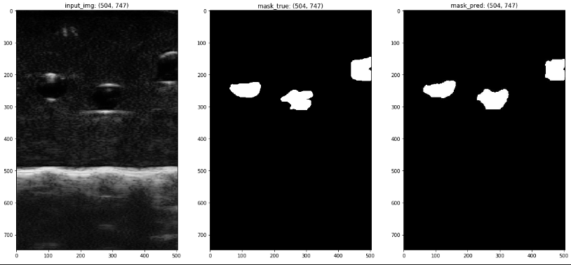
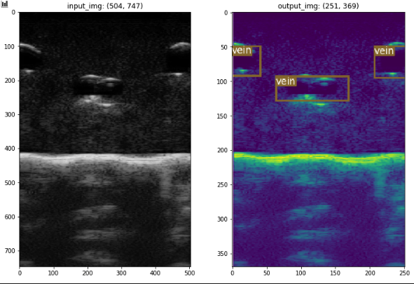

# Locating Veins on Infrared(Gray) Images for IV Insertion with Two Approaches - Segementation(U-Net) | Detection(YOLO)

This project is an self-implemented submodule of Robotic IV Insertion Project affiliated with a Duke Medical Lab, which has the similar idea as a paper Visual Vein-Finding for Robotics IV Insertion by R. D. Brewer and J. K. Salisbury. Genereally speaking, a fast and automated algorithm to find the precise vein edges on the captured infrared images can help suggest insertion points(region) for a human or robotic practitioner.

The images look like the following one because the deoxygenated haemoglobin in veins absorb infrared light more than surrounding tissues, which makes the veins appear as dark on a lighter background.

<p align="center">  </p>


# Progress & Notes
### Last Meet
- 从downsample image resolution的角度去看能否提升U-Net的速度
- 确定了一个统一的metric来衡量算法的accuracy: 比较中心点差距
- 在真实数据集上训练，并对于performance做统计对比分析。
- 搞懂yolo代码，对model部分进行修改。 

[Mid-term Report](https://docs.google.com/presentation/d/1ixdv6zaCGtkkfqN84M2ob_LZV4D6BFkfnUIeEUIfd7A/edit?usp=sharing)

修改意见：
- 介绍segmentation的网络结构时，放一个sample input和sample output
- segmentation results visualization可以用如下形式：
  ```
              human_label  
            /              \
  input_img                   overlapped image (two color layers showing direct differernce)
            \              / 
              predicte_img
  ```
- add mathematical functions 添加数学公式
- yolo的regression思想最好也通过简单的visualization来展现


## Segmentation - UNet
### Jan 30
- add 20 pairs of img-mask into 'data' directory
- modify the original n_channels = 3 to n_channels = 1 in train.py and predict.py when instantiating an U-Net
- modify glob() in __getitem__ of BasicDataset so that one img to one mask
- pip3 install future, tb-nightly (for torch.utils.tensorboard.SummaryWriter) - 'past module not installed'
- batchsize目前看来只能是1，待研究其中的原因。
- 解决了不能打开tensorboard的问题：运行diagnose_tensorboard.py文件，根据suggestions进行操作。- 实际上就是因为前面装了tb-nightly和pytorch内置的tensorboard冲突了。
- 解决了working with remote jupyter notebook ipynb on local vscode:（推荐方法二）
    - 方法一：
        - 在remote server terminal上运行 jupyter notebook --no-browser --port=8889
        - 在本地terminal运行 ssh -N -f -L localhost:8888:localhost:8889 joey@0.tcp.ngrok.io
        - 在本地浏览器打开localhost:8888
    - 方法二：
        - 下载ms-python extension。安装之后，选择python运行环境。

### Feb 5
- 确定了training用的是binary crossentropy, eval用的是dice loss
- torch.size() return [bs, channels, depth, height, width], 而pil_image.size return [width, height]。
- 猜测原本predict.py文件中多写了一步resize，使得output mask和input image的size不匹配。
- 将train.py中向tensorboard写images或者scalars的部分改成了每隔一个epoch写一次。
- 在ipyng中实现了：
    - 从一个model set中找到score最大的model.pth
    - draw training loss and validation score
    - 做一些当前performance的测试
- went through basic pipeline

### 初步结果
<p align="center">  </p>

### Next:
- 标Img_Invivo的200张。尽量给一个比较平滑的外边界，不要太在意边角。label的区域可以比实际的多一圈。
- 在新标的数据上，训练，完了统计evaluation performance。
  
- 加augmentation
- 尝试调整loss function
- 加weight matrix以给边界上的点更高权重
- 给prediction加上后处理 - 调用CV包去拟合一个elliptical shape


## Detection - YOLO
### Why YOLO
- fast. base version: 45 frames/s; fast version: 155 frames/s. (referred from YOLO paper)
- accurate. mAP is close to other SOTA models and less likely to get false positives on background.
- good generalization. it is less likely to break down when adapting into other domains like artwork.

### Mar 5
- labelled 20 samples - `phantom_20`
- wrote a util function in `yolo_eda.ipynb` to extract data concerning bbox attributes in xml file into txt, following the format: label_idx, xmin, xmax, ymin, ymax
- built yolo_detection pipeline by following the customization instructions given by the original readme.
- preliminarily finish training and evaluation on the `phantom_20` dataset.
  - mofidy `n_cpu` into 1.
  - modify `batch_size` into 1.
  - modify `epochs` into an approproate number, like 20 or 30.
- the image preprocessing defined in the customized dataset `datasets.ImageFolder` accept images of 3xWxH by default.
  - temporary solution: used `torch.tensor.expand` to add two more channels, whichs is actually channel-wise copy.

### Mar 15
- checked network strcuture and training loss from yolo/yolov2/yolov3 papers while referring the code
- thoroughly understood the whole training pipeline and how does detect.py uses the trained model to demo the results
- modified the network to adapt to training on gray images directly, instead of replicating 2 more channels like before
  - just change the channel number in `yolov3-custom.cfg` from 3 to 1
  - for later use, we could add a variable indicating channel number in `create_custom_model.sh` and replace corresponding hardcoded number into this variable.

### Mar 16
- recreate yolo custom config using the modified `create_custom_model.sh` and train without pretrained weights (for 3 channels), then check the results demo.
  - problem: some image samples got one more bbox on the same one target vein.
  - solution: increase `conf_thres` from 0.8 to 0.85 and decrease `nms_thres` from 0.4 to 0.35.
- tried to solve the inconsistency between input image size and saved output image size
  - problem: originally, (504, 747) vs. (254, 269).
    - solution: by checking the code in `detect.py`, found it probably due to using matplotlib to add bbox as matplotlib.patches to pyplot; -> so, just resize the saved ouput image to input image size and replace the old one.
  - but acutal problem: guessed the real reason is that some predicted bbox exceeds the image edges, which made matplotlib adaptively add white paddings around the plot while adding the created patches for the bboxes.
    - solution: modify the patches' coordinates by considering edges exceeding situations and the white paddings are not that obvious. But, they still exist.
- improved the visualization of saving resulted image plots by choosing left_top or right_bottom corner to put text
- wrote a sinle image prediction code block in `eda_yolo.ipynb`

### Mar 17
- finished labelling 91 invivo image samples from its original dataset with 190 samples.
- built a raw labelled data preprocessing pipeline for unet and yolo, which will help quickly replicate on another dataset with two methods.

### Mar 18
- built a shared YOLO training pipeline by modifying/adapting codes in dataset processing and files/dir setup
- retrain on phantom_20 and change `checkpoint_interval` from 1 to 2 and produce detect results into `ouput/phantom`
- simutaneously redirect printing outputs on console produced by `train.py` and `detect.py` into appropriate log files
- train yolo on invivo_91 and detect -> save model checkpoints and output image with bbox while also saving the print log on console into log files in `logs`
  - problem: invivo_91 images are 3-channel.
    - solution: unified the data processing pipeline by using `Image.open(path).convert('L')` in both `ImageFolder` and `ListDataset` in `datasets.py`. 
  - problem: found `126.jpg` does not have labelled bbox but mask which cause training interrupted due to failure on building targets.
    - solution: delete this sample and regenerate train.txt/valid.txt, which made invivo_91 actually has only 90 images rather than 90.

### Current Result
<p align="center">  </p>

### Next
- train unet on invivo_91 and detect
- evaluated them into demo results and check
- write unify evaluation pipeline to compare the two methods: efficiency vs. accuracy
- If necessary, consider using pytorch.tensorboard.utils to replace original tf.tensorboard utils.
- **Post-Processing - Active Contour**:
  - find active contour code on github, etc.
  - understand and try to modify them for our own use
  - if effective, use it to refine the vein edges on our segmentation(unet) and detection(yolo) methods to finalize a whole project demo.
- **If time allows**, consider designing a specified loss to directlt learn the target edge, which fits the end-to-end thoughts in deep learning.