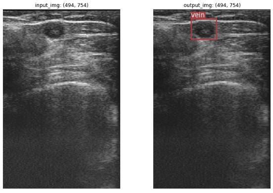

# Locating Veins on Infrared(Gray) Images for IV Insertion with Two Approaches - Segementation(U-Net) | Detection(YOLO)

This project serves as a frontend module of the Robotic IV Insertion Project maintained by Jing Zhang, under the supervision of a PHD student Guangshen Ma and a professor Dr. Daniel Buckland from Duke University, which has the similar idea as a paper Visual Vein-Finding for Robotics IV Insertion by R. D. Brewer and J. K. Salisbury.

Genereally speaking, a fast and automated algorithm to find the precise vein edges on the captured infrared images can help suggest insertion points(region) for a human or robotic practitioner.

Most of the implementation is based on [UNet](https://github.com/milesial/Pytorch-UNet) and [YOLOv3](https://github.com/eriklindernoren/PyTorch-YOLOv3), which are to locate veins from two perspectives: the former one is to segment out the target vein region, which is like pixel-wise classification; the later one is to put a rectangular bounding box around the target vein region. 

The images look like the following one because the deoxygenated haemoglobin in veins absorb infrared light more than surrounding tissues, which makes the veins appear as dark on a lighter background.

<p align="center"> 


</p>


## Segmentation - UNet
<p align="center">  </p>
<p align="center"> <em></em> 12.jpg in phantom_20 </p>

<p align="center">  </p>
<p align="center"> <em></em> 12.jpg in invivo_91 </p>

## Detection - YOLOv3
### Why YOLO
- fast. base version: 45 frames/s; fast version: 155 frames/s. (referred from YOLO paper)
- accurate. mAP is close to other SOTA models and less likely to get false positives on background.
- good generalization. it is less likely to break down when adapting into other domains like artwork.

<p align="center">  </p>
<p align="center"> <em></em> 0.jpg in phantom_20 </p>

<p align="center">  </p>
<p align="center"> <em></em> 0.jpg in invivo_91 </p>

## Performance Test : unet vs. yolo
#### Model Weights / Checkpoints
```
unet_phantom_ckpt = 'unet_ckpt_26.pth'
yolo_phantom_ckpt = 'yolov3_ckpt_38.pth'

unet_invivo_ckpt = 'unet_ckpt_20.pth'
yolo_invivo_ckpt = 'yolov3_ckpt_34.pth'
```

### Run separately
```
----- UNet Performance Summary on phantom_20 -----
Using device: cuda
Using model: checkpoints/phantom_20/unet_ckpt_26.pth
Total samples: 20
Total inference time: 1.65789s 	 Average inference time: 0.08289s 	 Average val score: 0.975
-----------------------

----- UNet Performance Summary on invivo_91 -----
Using device: cuda
Using model: checkpoints/invivo_91/unet_ckpt_20.pth
Total samples: 90
Total inference time: 1.96892s 	 Average inference time: 0.02188s 	 Average val score: 0.969
-----------------------
```

```
----- YOLOv3 Performance Summary on phantom_20 -----
Using device: cuda
Using model: checkpoints/phantom_20/yolov3_ckpt_38.pth
Total samples: 20 detected samples: 20
Precision: 1.000 Recall: 1.000 AP: 1.000 f1: 1.000 ap_class: [0]
Total inference time: 2.24476s
Average inference time: 0.11224s Average prediction confidence: 0.962 Average iou: 0.780
-----------------------

----- YOLOv3 Performance Summary on invivo_91 -----
Using device: cuda
Using model: checkpoints/invivo_91/yolov3_ckpt_34.pth
Total samples: 90 detected samples: 89
Precision: 0.989 Recall: 0.979 AP: 0.979 f1: 0.984 ap_class: [0]
Total inference time: 4.52317s
Average inference time: 0.05026s Average prediction confidence: 0.975 Average iou: 0.793
-----------------------
```


### Run together
```
Phantom_20

Using device: cpu
Dataset - phantom_20: UNet/data/imgs/phantom_20
Total samples: 20
Model Weights: 
	- unet: UNet/checkpoints/phantom_20/unet_ckpt_26.pth
	- yolo: YOLOv3/checkpoints/phantom_20/yolov3_ckpt_38.pth
Average prediction speed/time (s): 
	- unet: 2.6939
	- yolo: 0.4372
Average centroid prediction error: 
	- unet: 1.99539
	- yolo: 6.73612

Using device: cuda
Dataset - phantom_20: UNet/data/imgs/phantom_20
Total samples: 20
Model Weights: 
  - unet: UNet/checkpoints/phantom_20/unet_ckpt_26.pth
  - yolo: YOLOv3/checkpoints/phantom_20/yolov3_ckpt_38.pth
Average prediction speed/time (s): 
  - unet: 0.0808
  - yolo: 0.0251
Average centroid prediction error: 
  - unet: 1.99539
  - yolo: 6.73612
```

```
Invivo_91

Using device: cpu
Dataset - invivo_91: UNet/data/imgs/invivo_91
Total samples: 90
Model Weights: 
	- unet: UNet/checkpoints/invivo_91/unet_ckpt_20.pth
	- yolo: YOLOv3/checkpoints/invivo_91/yolov3_ckpt_34.pth
Average prediction speed/time (s): 
	- unet: 2.5301
	- yolo: 0.4533
Average centroid prediction error: 
	- unet: 4.12972
	- yolo: 8.08504

Using device: cuda
Dataset - invivo_91: UNet/data/imgs/invivo_91
Total samples: 90
Model Weights: 
	- unet: UNet/checkpoints/invivo_91/unet_ckpt_20.pth
	- yolo: YOLOv3/checkpoints/invivo_91/yolov3_ckpt_34.pth
Average prediction speed/time (s): 
	- unet: 0.0232
	- yolo: 0.0241
Average centroid prediction error: 
	- unet: 4.12972
	- yolo: 8.08504
```

#### Analysis
- YOLO's centroid prediction error is obviously greater than UNet.
  - approximately twice on Invivo_91
  - and 6 times on Phantom_20. 
- Using cpu or cuda(gpu) does not really affect the prediction accuracy, but affect the prediction speed a lot.
  - the prediction speed of using cuda is over 100 times faster than using cpu for UNet,
  - and around 20 times faster than using cpu for YOLO.
- In short, Unet can suggest a more accurate centroid while YOLO runs faster than UNet with cpu provideed only and almost same as Unet when using cuda.

## Progress & Notes
[Mid-term Report](https://docs.google.com/presentation/d/1ixdv6zaCGtkkfqN84M2ob_LZV4D6BFkfnUIeEUIfd7A/edit?usp=sharing)

修改意见：
- 介绍segmentation的网络结构时，放一个sample input和sample output
- segmentation results visualization可以用如下形式：
  ```
              human_label  
            /              \
  input_img                   overlapped image (two color layers showing direct differernce)
            \              / 
              predicte_img
  ```
- add mathematical functions 添加数学公式
- yolo的regression思想最好也通过简单的visualization来展现


#### Jan 30
- labelled the `phantom_20` dataset of 20 samples
- go over the original code and adapt into our dataset or situation
  - modify `n_channels = 3` to `n_channels = 1` in train.py and segment.py when instantiating U-Net
  - modify glob() in `__getitem__` of BasicDataset so that one img to one mask
  - batchsize seemed only to be 1.
  - solved the problem that tensorboard could not be openned
    - run `diagnose_tensorboard.py` and operate according to the printed suggestions.
    - the reason behind was the confliction between `tb-nightly` and the integrated tensorboard in `pytorch` 
- working with remote jupyter notebook ipynb on local vscode: (recommend the second method)
  - method 1: 
    - run `jupyter notebook --no-browser --port=8889` on remote server's console
    - run `ssh -N -f -L localhost:8888:localhost:8889 joey@0.tcp.ngrok.io` on local console
    - go to `localhost:8888` on local browser
  - method 2：
    - download ms-python extension
    - choose proper virtual python environment

#### Feb 5
- confirmed that the training loss is binary crossentropy and evaluation score is dice loss, which is like iou.
- how to decide the dimension of "image":
  - torch.size() --> [bs, channels, depth, height, width]
  - pil_image.size --> [width, height]
  - image_arr.shape --> [height, width]
- modify the frequency of writing images/scalars into tensorboard during training into per epoch.
- wrote in ipynb:
  - find the best model weight from a set of model weights
  - draw training loss and validation score
  - single sample performance test
- basically finished the whole pipeline: training & evaluation

#### Mar 5
- labelled 20 samples - `phantom_20`
- wrote a util function in `yolo_eda.ipynb` to extract data concerning bbox attributes in xml file into txt, following the format: label_idx, xmin, xmax, ymin, ymax
- built yolo_detection pipeline by following the customization instructions given by the original readme.
- preliminarily finish training and evaluation on the `phantom_20` dataset.
  - mofidy `n_cpu` into 1.
  - modify `batch_size` into 1.
  - modify `epochs` into an approproate number, like 20 or 30.
- the image preprocessing defined in the customized dataset `datasets.ImageFolder` accept images of 3xWxH by default.
  - temporary solution: used `torch.tensor.expand` to add two more channels, whichs is actually channel-wise copy.

#### Mar 15
- checked network strcuture and training loss from yolo/yolov2/yolov3 papers while referring the code
- thoroughly understood the whole training pipeline and how does detect.py uses the trained model to demo the results
- modified the network to adapt to training on gray images directly, instead of replicating 2 more channels like before
  - just change the channel number in `yolov3-custom.cfg` from 3 to 1
  - for later use, we could add a variable indicating channel number in `create_custom_model.sh` and replace corresponding hardcoded number into this variable.

#### Mar 16
- recreate yolo custom config using the modified `create_custom_model.sh` and train without pretrained weights (for 3 channels), then check the results demo.
  - problem: some image samples got one more bbox on the same one target vein.
  - solution: increase `conf_thres` from 0.8 to 0.85 and decrease `nms_thres` from 0.4 to 0.35.
- tried to solve the inconsistency between input image size and saved output image size
  - problem: originally, (504, 747) vs. (254, 269).
    - solution: by checking the code in `detect.py`, found it probably due to using matplotlib to add bbox as matplotlib.patches to pyplot; -> so, just resize the saved ouput image to input image size and replace the old one.
  - but acutal problem: guessed the real reason is that some predicted bbox exceeds the image edges, which made matplotlib adaptively add white paddings around the plot while adding the created patches for the bboxes.
    - solution: modify the patches' coordinates by considering edges exceeding situations and the white paddings are not that obvious. But, they still exist.
- improved the visualization of saving resulted image plots by choosing left_top or right_bottom corner to put text
- wrote a sinle image prediction code block in `eda_yolo.ipynb`

#### Mar 17
- finished labelling 91 invivo image samples from its original dataset with 190 samples.
- built a raw labelled data preprocessing pipeline for unet and yolo, which will help quickly replicate on another dataset with two methods.

#### Mar 18
- built a shared YOLO training pipeline by modifying/adapting codes in dataset processing and files/dir setup
- retrain on phantom_20 and change `checkpoint_interval` from 1 to 2 and produce detect results into `ouput/phantom`
- simutaneously redirect printing outputs on console produced by `train.py` and `detect.py` into appropriate log files
- train yolo on invivo_91 and detect -> save model checkpoints and output image with bbox while also saving the print log on console into log files in `logs`
  - problem: invivo_91 images are 3-channel.
    - solution: unified the data processing pipeline by using `Image.open(path).convert('L')` in both `ImageFolder` and `ListDataset` in `datasets.py`. 
  - problem: found `126.jpg` does not have labelled bbox but mask which cause training interrupted due to failure on building targets.
    - solution: delete this sample and regenerate train.txt/valid.txt, which made invivo_91 actually has only 90 images rather than 90.
- train unet on invivo_91 by `train.py` and evaluate to produce results into `output` by `segment.py` and check
  - modified large parts of UNet project codes, following the pipeline idea of YOLO

#### Mar 19
- preliminarily tested performance on two datasets for UNet
  - prediction speed -> time that the model spent on prediction only, without other post-processing
  - accuracy/powerfulness -> how good the model is predicting

#### Mar 20
- basically tested performance on two datasets for YOLOv3
  - prediction speed
  - accuracy/powerfulness


#### Mar 21
- wrote `compare.py` but spent a lot of time on debugging the import failure in the module under a package
  - renamed the two packages' utils module name to avoid name confliction
  - specify an absolute environment path for one of them

#### Mar 22
- basically finished the comparison between unet and yolo in terms of prediction speed and the accuracy of the predicted centroids
- added: compute the outlier ratio for the centroid errors. -> z-score method

#### Mar 23
- preliminarily built a ipynb to processing active contour based on detection result
  - adjust parameters given by skimage active contour api
  - 增加init的边界
    - 考虑用unet的predicted centroid，定一个半径。
  - 考虑change image brightness/contrast，来让vein更突出来

#### Mar 24
- finish the first version of my poster with the experiment results

### NEXT
- modify two sub-projects' readme -> mainly describe usages

### Future Work
- YOLO-lite can be even faster than YOLO base
- UNet accuracy could be enhanced futher:
  - add augmentation
  - adjust loss function to assign more weights for pixels on edges
  - consider downsampling image size to do prediction and rescale back for outputs -> tradeoff between improving speed and maintaing accuracy
- consider designing a specified loss to directlt learn the target edge, which fits the end-to-end thoughts in deep learning.
- **Post-Processing - Active Contour**:
  - find self-implemented active contour code on github, etc.
  - understand and try to modify them for our own use
  - if effective, use it to refine the vein edges on our segmentation(unet) and detection(yolo) methods to finalize a whole project demo.
- consider using pytorch.tensorboard.utils to replace original tf.tensorboard utils -> show learning curve.
- better visualization comparison: write util function to produce img/visualization comparison among input vs. label vs. prediction